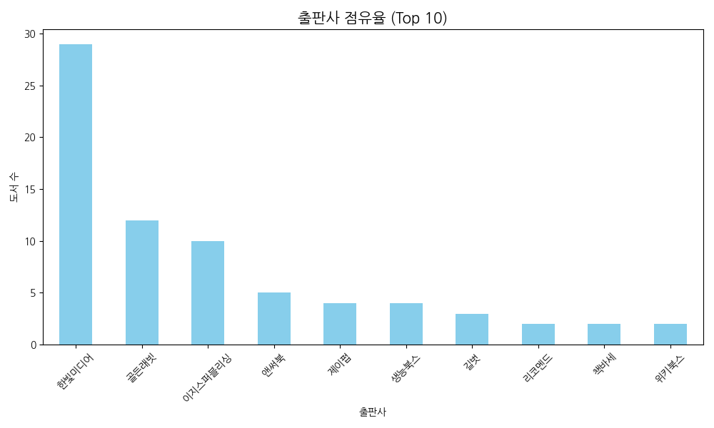
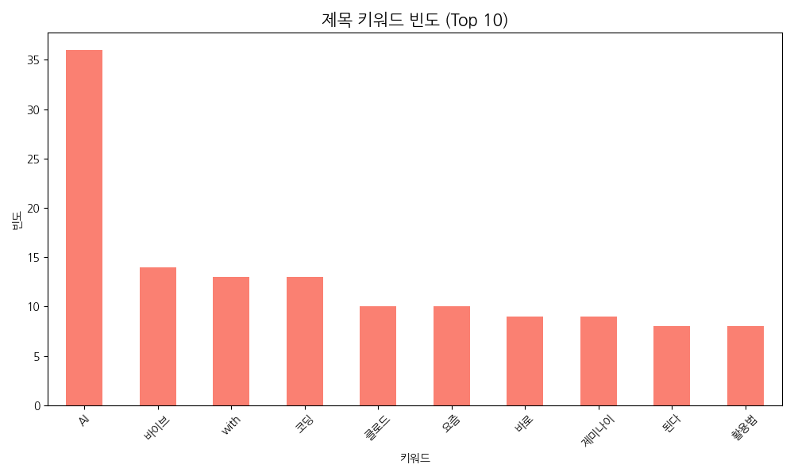
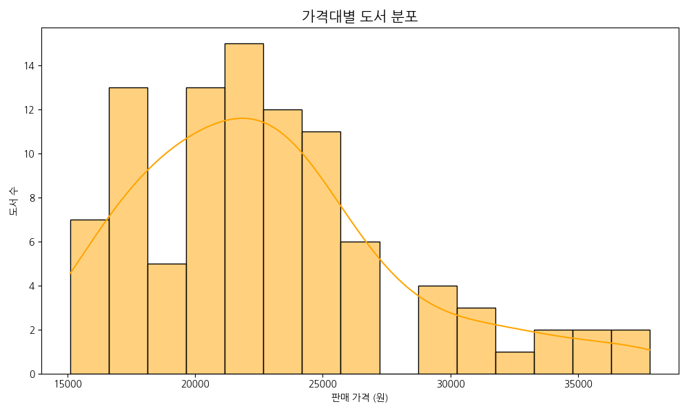
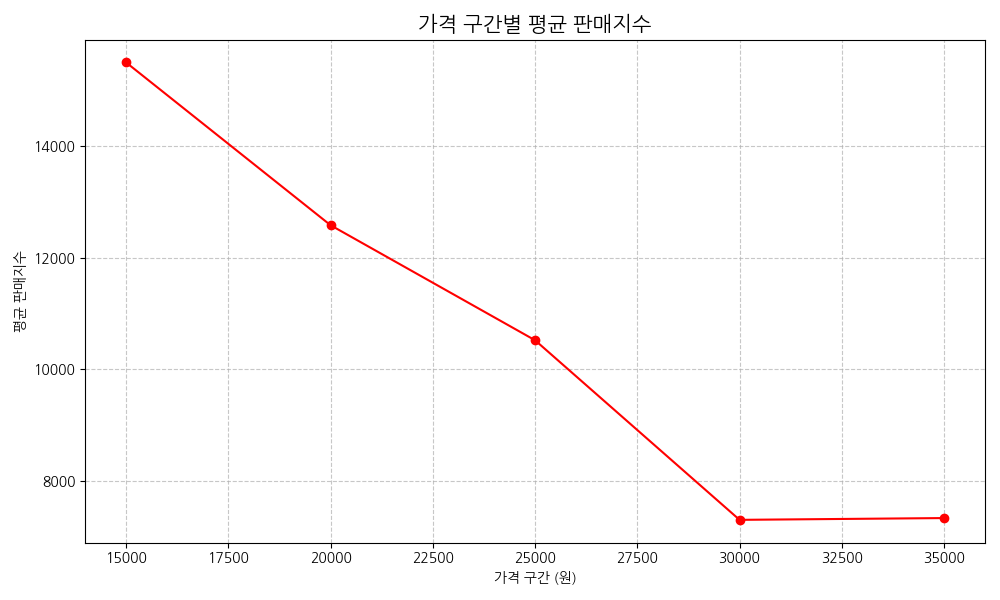
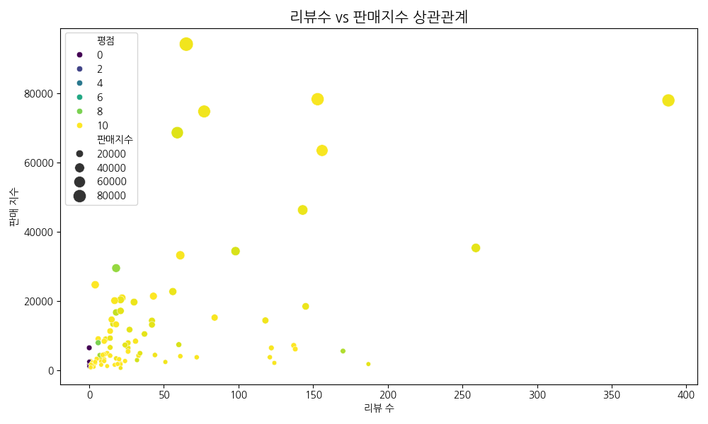
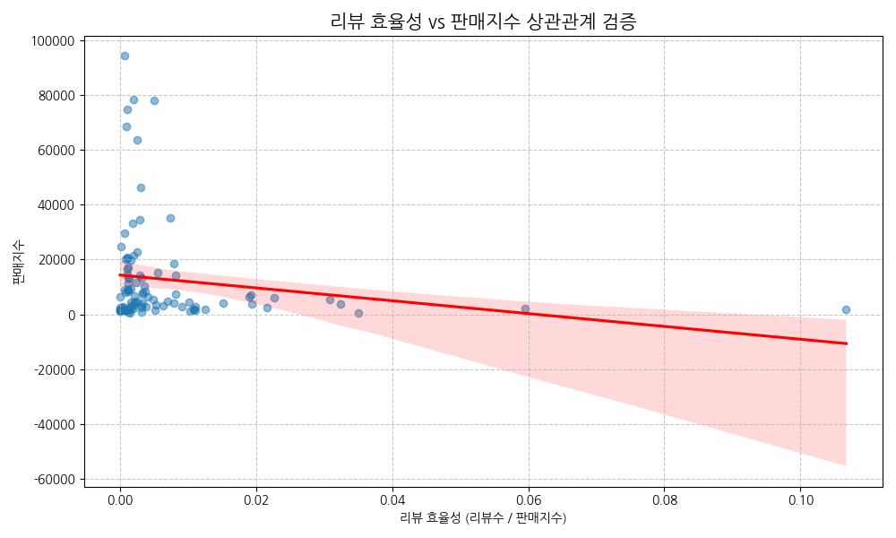

# 📊 YES24 IT 베스트셀러 패턴 분석 리포트 (EDA)

<h2 style="color: #1e3a8a; border-left: 5px solid #3b82f6; padding-left: 12px; margin-top: 1.5em; margin-bottom: 0.5em;">0. 분석 목적 및 배경 (Analysis Purpose)</h2>
본 분석은 YES24 IT/컴퓨터 카테고리의 실시간 베스트셀러 데이터를 바탕으로, <b>상위 도서에서 관찰되는 주요 패턴을 식별하고 가설을 도출</b>하는 것을 목적으로 합니다. 

- **상위 도서 공통 특성 파악**: 시장에서 활발히 소비되는 도서들의 가격, 출판사, 키워드 경향을 탐색합니다.
- **연관 패턴 도출**: 변수 간의 통계적 경향을 확인하여, 특정 속성과 판매 성과 사이의 연관된 패턴을 분석합니다.
- **가설 기반 제언**: 관찰된 데이터 패턴을 근거로, 향후 도서 기획 및 마케팅 전략 수립에 참고할 수 있는 가설적 시사점을 제시합니다.

<h2 style="color: #1e3a8a; border-left: 5px solid #3b82f6; padding-left: 12px; margin-top: 1.5em; margin-bottom: 0.5em;">📊 핵심 인사이트 요약 (Executive Summary)</h2>

- **트렌드 키워드 노출**: 최신 기술 키워드(AI, ChatGPT, Python 등)가 상위 도서에서 반복적으로 관찰됨 → 키워드 기반 콘텐츠 전략이 판매 성과와 연관된 주요 패턴으로 확인
- **시장 수용 가격대**: IT 베스트셀러는 25,000 ~ 35,000원 구간에서 높은 판매 집중 현상 발생 → 명확한 독자 수용 가격 구간 존재 확인
- **리뷰 지표의 한계**: 리뷰 효율성과 판매지수 간 상관계수 약 0.17로 매우 낮음 → 리뷰는 판매 성과를 설명하는 주요 변수가 아니며, 사후 반응인 후행 지표로 해석 가능

<blockquote style="background: #f9f9f9; border-left: 10px solid #ccc; margin: 1.5em 10px; padding: 0.5em 10px;">
<b>[중요] 데이터 분석의 한계 및 유의사항</b> 
1. <b>표본의 제한성</b>: 본 데이터는 YES24 '베스트셀러' 순위에 진입한 도서만을 대상으로 하므로, 전체 IT 도서 시장의 일반적인 특성을 대표하기에는 한계가 존재합니다. 
2. <b>패턴 분석의 성격</b>: 본 리포트는 인과 관계(Causality)를 증명하는 것이 아닌, 데이터 간의 <b>연관성(Association)과 경향성</b>을 확인하는 탐색적 분석입니다. 
3. <b>해석의 유의점</b>: 관찰된 패턴은 외부 마케팅 환경, 시즌성 등 수집되지 않은 다양한 변수의 영향을 받을 수 있으므로 일반화 시 주의가 필요합니다.
</blockquote>

<h2 style="color: #1e3a8a; border-left: 5px solid #3b82f6; padding-left: 12px; margin-top: 1.5em; margin-bottom: 0.5em;">1. 데이터 개요 (Data Overview)</h2>
<table style="width: 100%; border-collapse: collapse; margin-bottom: 1em;">
<thead>
<tr style="background-color: #f8fafc;"><th style="border: 1px solid #ddd; padding: 8px 12px; text-align:center">항목</th><th style="border: 1px solid #ddd; padding: 8px 12px; text-align:left">내용</th></tr>
</thead>
<tbody>
<tr><td style="border: 1px solid #ddd; padding: 8px 12px; text-align:center"><b>분석 대상</b></td><td style="border: 1px solid #ddd; padding: 8px 12px; text-align:left">YES24 IT/컴퓨터 카테고리 실시간 베스트셀러 (Top 100+)</td></tr>
<tr><td style="border: 1px solid #ddd; padding: 8px 12px; text-align:center"><b>핵심 변수</b></td><td style="border: 1px solid #ddd; padding: 8px 12px; text-align:left">도서명, 출판사, 판매지수, 리뷰수, 평점, 정가</td></tr>
<tr><td style="border: 1px solid #ddd; padding: 8px 12px; text-align:center"><b>분석 관점</b></td><td style="border: 1px solid #ddd; padding: 8px 12px; text-align:left">키워드 빈도, 가격-판매 분포, 독자 참여 패턴 연관성</td></tr>
</tbody>
</table>

<h2 style="color: #1e3a8a; border-left: 5px solid #3b82f6; padding-left: 12px; margin-top: 1.5em; margin-bottom: 0.5em;">2. 제목 키워드 분석 (Keyword Trend Pattern)</h2>

- **주요 관찰 패턴**: 'AI', 'Python', 'ChatGPT', '데이터' 등의 최신 기술 키워드가 상위권에서 반복적으로 관찰됩니다.
- **도출 가설**: 시장 수요가 높은 특정 키워드를 제목에 노출하는 것이 독자의 구매 경향과 연관된 패턴으로 나타납니다.

<h2 style="color: #1e3a8a; border-left: 5px solid #3b82f6; padding-left: 12px; margin-top: 1.5em; margin-bottom: 0.5em;">3. 가격대별 판매 성과 패턴 (Price Performance Pattern)</h2>

- **주요 관찰 패턴**: IT 베스트셀러는 주로 25,000원 ~ 35,000원 구간에서 높은 판매지수가 집중적으로 관찰됩니다.
- **도출 가설**: 독자는 콘텐츠 전문성에 따라 특정 가격대를 합리적으로 수용하며, 단순 저가보다는 정보 가치와의 정합성이 중요하게 작용합니다.

<h2 style="color: #1e3a8a; border-left: 5px solid #3b82f6; padding-left: 12px; margin-top: 1.5em; margin-bottom: 0.5em;">4. 리뷰 및 판매 지수의 연관성 (Engagement Pattern)</h2>

- **주요 관찰 패턴**: 리뷰 수와 판매지수가 일관된 선형 관계를 보이지 않으며, 리뷰는 판매 확보 이후 누적되는 후행 지표로 해석 가능한 패턴이 나타납니다.
- **도출 가설**: 리뷰는 초기 판매 견인보다, 판매 이후 형성되는 반응 지표로서 도서의 신뢰도를 보완하는 패턴으로 작용합니다.

<h2 style="color: #1e3a8a; border-left: 5px solid #3b82f6; padding-left: 12px; margin-top: 1.5em; margin-bottom: 0.5em;">5. 리뷰 효율성 분석 (Review Efficiency Pattern)</h2>

<b>리뷰 효율성 공식</b> 
리뷰 효율성 = 리뷰수 / 판매지수 
<i>*판매량 대비 리뷰 발생 비율을 의미하며, 독자의 관여도를 분석하는 척도로 활용합니다.*</i>

- **주요 관찰 패턴**: 효율성 지표의 차이는 도서 성격과 독자층의 특성에 따른 참여 패턴의 차이를 보여주며, 이는 도서별 맞춤형 독자 관리의 필요성을 시사합니다.

<h2 style="color: #1e3a8a; border-left: 5px solid #3b82f6; padding-left: 12px; margin-top: 1.5em; margin-bottom: 0.5em;">6. 독자 만족도 패턴 (Rating Trend)</h2>
- **주요 관찰 패턴**: 대부분의 도서가 9.0점 이상의 높은 평점에 집중되어 있는 '상향 평준화' 경향이 확인됩니다. 높은 평점은 판매 차별화 요소보다 기본 요건으로서의 성격이 강합니다.

<h2 style="color: #1e3a8a; border-left: 5px solid #3b82f6; padding-left: 12px; margin-top: 1.5em; margin-bottom: 0.5em;">7. 가설 검증 (Validation)</h2>

- **상관계수 분석**: 상관계수는 <b>-0.1698</b>로 산출되었으며, 두 변수 사이에 <b>뚜렷한 선형 관계가 확인되지 않음</b>을 통계적으로 보여줍니다.
- **그룹 비교 분석**: 효율성 기준 3개 그룹 비교 결과, 판매지수 간에 <b>유의미한 차이가 나타나지 않았습니다.</b>

<b>💡 검증 인사이트 요약</b>: 리뷰 효율성은 판매 성과를 설명하는 주요 설명 변수로 보기 어려우며, 설명 변수로서 한계가 존재함이 확인되었습니다.

<h2 style="color: #1e3a8a; border-left: 5px solid #3b82f6; padding-left: 12px; margin-top: 1.5em; margin-bottom: 0.5em;">8. 📌 Action Insight (실무 활용 시사점)</h2>

<h3 style="color: #3b82f6;">1. 키워드 기반 콘텐츠 전략</h3>
- 시장 수요가 높은 기술 키워드가 상위 도서에서 지속적으로 노출됨 
→ 신간 기획 시 핵심 기술 키워드 전면 배치 전략 활용 가능

<h3 style="color: #3b82f6;">2. 가격 전략 최적화</h3>
- 25,000원 ~ 35,000원 구간에서 판매지수가 가장 높게 집중됨 
→ 해당 구간을 목표 수용 가격대로 설정 및 가격 설계 적용 가능

<h3 style="color: #3b82f6;">3. 마케팅 전략 방향</h3>
- 리뷰는 판매의 선행 요인이 아닌 후행 지표로 해석되는 패턴 확인 
→ 초기 마케팅 시 리뷰 확보보다 검색 최적화 및 콘텐츠 경쟁력 강화에 우선순위 적용 가능

<h3 style="color: #3b82f6;">4. 독자 참여 전략 차별화</h3>
- 도서 성격에 따라 리뷰 참여도와 성과 간 패턴 차이 존재 
→ 도서 카테고리별 맞춤형 독자 참여 유도 전략 차별화 적용 가능

<h3 style="color: #3b82f6;">5. 데이터 기반 기획 프로세스</h3>
- 성공한 베스트셀러 도서들의 공통 패턴 확인 
→ 성공 도서의 데이터 패턴을 기획 의사결정 및 리스크 관리 참고 자료로 활용 가능

<h2 style="color: #1e3a8a; border-left: 5px solid #3b82f6; padding-left: 12px; margin-top: 1.5em; margin-bottom: 0.5em;">9. 종합 결론 및 분석의 한계 (Conclusion & Limitations)</h2>

<h3 style="color: #3b82f6;">📋 분석 결과 요약</h3>
본 분석을 통해 YES24 IT 베스트셀러 시장은 <b>최신 기술 키워드의 높은 가시성, 특정 가격대의 견고한 수요층, 그리고 판매 후 성과 지표로서의 리뷰 누적</b>이라는 세 가지 공통 패턴을 보유하고 있음을 확인했습니다. 특히 리뷰 지표는 판매 성과를 직접적으로 설명하기보다 독자의 사후 참여도를 반영하는 보조 지표로서의 성격이 강하게 나타납니다.

<h3 style="color: #3b82f6;">💡 실무 제언</h3>
→ <b>"데이터가 증명하는 시장 수용 패턴(키워드, 가격)을 기획의 기본 프레임으로 설정하고, 마케팅 자원은 초기 도달률 확보에 집중할 것"</b>

<b>분석의 한계점</b> 
- 본 분석은 베스트셀러라는 결과 데이터 기반의 패턴 분석이며, 판매 요인의 인과 관계를 규명하기 위한 분석이 아님을 명시합니다. 
- 관찰된 경향은 특정 시점의 데이터로 해석되어야 하며, 전체 시장 일반화를 위해서는 대조군(비베스트셀러)을 포함한 추가 검증이 반드시 필요합니다.

