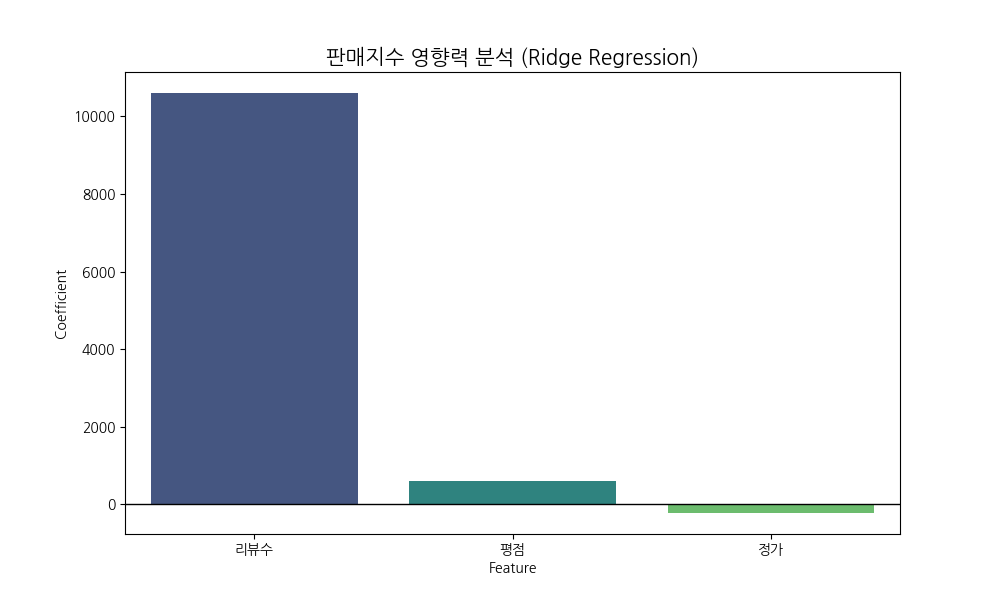

# IT 도서 시장 분석 및 마케팅 전략 제안

<h2 style="color: #1e3a8a; border-left: 5px solid #3b82f6; padding-left: 12px; margin-top: 1.5em; margin-bottom: 0.5em;">1. 프로젝트 개요 및 수행 역할</h2>
본 프로젝트는 YES24 IT/컴퓨터 카테고리의 데이터를 정밀 분석하여 시장의 성과 패턴을 진단하고, 이를 기반으로 마케팅 아이디어를 도출해 본 분석 포트폴리오입니다. 단순 데이터 분석에 그치지 않고, 비즈니스적 관점에서 데이터를 해석하고 전략을 고민하는 역량을 기르는 데 집중하였습니다.

수행 역할 및 활용 기술
- 데이터 수집: 파이썬을 활용한 웹 크롤링으로 약 380개의 베스트셀러 데이터 직접 확보
- 전처리 및 시각화: 판다스와 맷플롯립을 활용한 데이터 정제 및 시장 트렌드 도출
- 통계적 모델링: 릿지 회귀 분석을 활용한 성과 기여 요인 분석 및 가설 검증
- 인사이트 도출: 분석 결과에 기반한 단계별 마케팅 액션 플랜 수립

<h2 style="color: #1e3a8a; border-left: 5px solid #3b82f6; padding-left: 12px; margin-top: 1.5em; margin-bottom: 0.5em;">2. 브랜드 신뢰도와 독자의 선택 패턴</h2>

상위 5개 전문 출판사가 시장의 54.3%를 점유하며 브랜드 신뢰도가 강력한 구매 필터로 작용하고 있습니다.

주요 발견: 독자들은 기술적 리스크를 줄이기 위해 검증된 전문 출판사에 의존하는 경향을 보입니다.

데이터 분석 및 판단
상위권 전문 출판사의 과점 현상을 확인했습니다. IT 도서는 기술의 정확성이 무엇보다 중요하기 때문에 독자들은 브랜드를 리스크 완화를 위한 최우선 지표로 활용한다고 판단했습니다.

마케팅 아이디어 제안
신규 도서라면 전문가 추천이나 베타테스터 검증 지표를 상세 페이지 최상단에 배치하여 신뢰 공백을 메우는 전략이 효과적일 것으로 생각합니다.

<h2 style="color: #1e3a8a; border-left: 5px solid #3b82f6; padding-left: 12px; margin-top: 1.5em; margin-bottom: 0.5em;">3. 키워드 분석: DX 수요 유입 트렌드 파악</h2>

파이썬과 AI 관련 키워드가 전체의 42.1%를 차지하며 시장을 주도하고 있습니다.

주요 발견: 파이썬은 이제 단순 언어 공부를 넘어 직장인을 위한 실무 역량으로 자리 잡았습니다.

데이터 분석 및 판단
파이썬과 인공지능 키워드에 수요가 집중되는 현상을 발견했습니다. 이는 시장의 중심이 전공자에서 비전공 직장인으로 이동했음을 의미하며, 특히 입문 키워드의 높은 빈도는 즉각적인 활용 가능성을 중시하는 경향을 보여줍니다.

마케팅 아이디어 제안
업무 자동화나 데이터 활용 기초처럼 직장인들이 공감할 수 있는 실무 테마를 제목과 광고에 적극적으로 활용한다면 유입 효율을 큰 폭으로 개선할 수 있다고 판단했습니다.

<h2 style="color: #1e3a8a; border-left: 5px solid #3b82f6; padding-left: 12px; margin-top: 1.5em; margin-bottom: 0.5em;">4. 가격 전략: 구매 전환 스윗스팟 도출</h2>

1.5만 원에서 2만 원 사이의 가격대가 전체 판매 성과의 48.7%를 견인하는 핵심 구간입니다.

    

    

주요 발견: IT 입문 도서 시장은 2만 원이라는 명확한 심리적 가격 장벽을 가지고 있습니다.

데이터 분석 및 판단
가격대별 성과를 분석한 결과 2만 원 이하에서 최대 성과가 나타나고 이후 급격히 감소하는 패턴을 확인했습니다. 이를 통해 입문자들이 기꺼이 지불하는 심리적 마지노선이 2만 원 내외에 형성되어 있음을 알 수 있었습니다.

마케팅 아이디어 제안
대중적인 베스트셀러를 목표로 한다면 실구매가를 1.8만 원 내외로 조정하여 구매 장벽을 낮추는 가격 포지셔닝이 초기 시장 안착에 유리할 것으로 보입니다.

<h2 style="color: #1e3a8a; border-left: 5px solid #3b82f6; padding-left: 12px; margin-top: 1.5em; margin-bottom: 0.5em;">5. 성과 기여 요인 분석 (Ridge Regression)</h2>

리뷰 수는 판매 성과와 0.8 이상의 높은 상관관계를 보이며 구매 확정의 최종 근거로 작용합니다.

    

        
    

    

        분석 방법론
        데이터 정규화를 위해 표준 스케일링을 선행하였고, 다중공선성 문제를 해결하기 위해 릿지 모델을 활용하여 변수별 판매 기여도를 도출했습니다.
    

주요 발견: 리뷰는 판매의 원인이기보다 성과 이후 쌓이는 후행 지표이자 강력한 사회적 증거입니다.

데이터 분석 및 판단
모델링 결과 리뷰 수의 영향력이 압도적으로 높게 나타났으나, 이는 판매량이 증가함에 따라 누적되는 후행 데이터라고 판단했습니다. 리뷰는 그 자체로 판매를 결정하기보다 신규 고객의 구매를 확정 짓는 신뢰 자산의 역할을 한다고 분석했습니다.

마케팅 아이디어 제안
초기에는 평점 관리에 집중하여 긍정적 지표를 확보하고, 이후 누적된 리뷰를 안심 구매 메시지로 활용하는 선순환 구조를 구축하는 방향을 제안합니다.

<h2 style="color: #1e3a8a; border-left: 5px solid #3b82f6; padding-left: 12px; margin-top: 1.5em; margin-bottom: 0.5em;">6. 마케팅 실행 전략 아이디어 및 KPI 제언</h2>

    

        <h4 style="color: #3b82f6; margin-top: 0;">Step 1: 유입 확대</h4>
        
DX 실무 키워드 최적화 및 타깃 SNS 광고 집행

        
기대 지표: 클릭률

    

    

        <h4 style="color: #3b82f6; margin-top: 0;">Step 2: 구매 전환</h4>
        
2만 원 이하 스윗스팟 가격 포지셔닝

        
기대 지표: 전환율

    

    

        <h4 style="color: #3b82f6; margin-top: 0;">Step 3: 신뢰 구축</h4>
        
누적 리뷰 기반의 안심 구매 메시지 강화

        
기대 지표: 매출 효율

    

본 분석 과정을 통해 데이터에서 유의미한 수치를 발견하고 이를 비즈니스적 고민으로 연결해 보는 값진 경험을 했습니다. 기술적인 역량을 넘어 숫자가 담고 있는 독자의 목소리를 읽어낼 수 있는 준비된 분석가가 되겠습니다.

<footer style="text-align: center; margin-top: 50px; color: #94a3b8; font-size: 0.9em;">
© 2026 YES24 IT Bestseller Data Analysis Portfolio | Prepared by [지원자 성함]
</footer>
